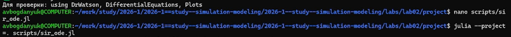
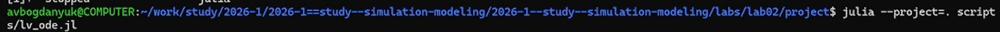
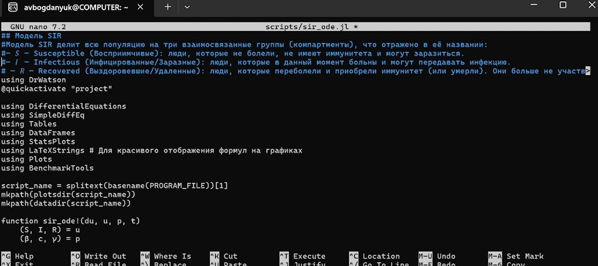
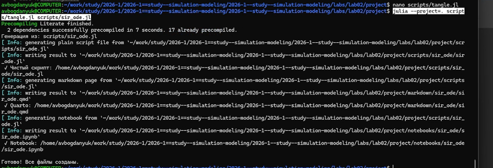

---
## Author
author:
  name: Богданюк Анна Васильевна
  degrees: НКНбд-01-23
  affiliation:
    - name: Российский университет дружбы народов
      country: Российская Федерация
## Title
title: "Лабораторная работа 1"
subtitle: "Имитационное моделирование"
date-format: "2026-03-07"
---

# Цель работы

Целью данной лабораторной работы является создание моделей SIR и Лотки–Вольтерры на языке Julia, используя литературное программирование.

# Задание

1. Создать рабочий каталог для всего курса.
2. Установить необходимые пакеты.
3. Выполнить предложенный код.
4. Преобразовать код в литературный стиль.
5. Сгенерировать из литературного кода:
6. чистый код;
7. jupyter notebook;
8. документацию в формате Quarto.
9. Выполнить код из jupyter notebook.
10. Интегрировать документацию в формате Quarto в отчёт.
11. Добавить в код в литературном стиле вычисление для набора параметров.
12. Сгенерировать из литературного кода с параметрами:
13. чистый код;
14. jupyter notebook;
15. документацию в формате Quarto.
16. Выполнить код из jupyter notebook с параметрами.
17. Интегрировать документацию с параметрами в формате Quarto в отчёт.

# Теоретическое введение

## Модель SIR

Модель SIR (Kermack & McKendrick, 1927) делит популяцию на три группы:
**S (Susceptible)** — восприимчивые к болезни (здоровые, но могут заразиться);
**I (Infectious)** — инфицированные и заразные (активно болеют и передают инфекцию);
**R (Recovered)** — переболевшие и имеющие иммунитет (или удаленные из процесса, включая умерших).

## Основные допущения модели
Популяция закрыта (нет рождений, смертей и миграции): N = S + I + R = const.
Однородное смешение: каждый восприимчивый имеет равные шансы встретить заразного.
Постоянные параметры: заразность (β) и скорость выздоровления (γ) не меняются.
Отсутствие латентного периода: после заражения человек сразу становится заразным.
Пожизненный иммунитет: переболевшие больше не заражаются.

## Трёхпараметрическая форма модели

В данной реализации используется декомпозиция параметра заразности:
**β** — вероятность передачи инфекции **при одном контакте** (биологический фактор);
**c** — среднее число контактов одного человека в единицу времени (поведенческий фактор);
**γ** — скорость выздоровления (1/γ — средняя продолжительность болезни).

## Система дифференциальных уравнений:
$$
\begin{cases}
\frac{dS}{dt} = -\beta \cdot c \cdot \frac{I}{N} \cdot S \\[1em]
\frac{dI}{dt} = \beta \cdot c \cdot \frac{I}{N} \cdot S - \gamma \cdot I \\[1em]
\frac{dR}{dt} = \gamma \cdot I
\end{cases}
$$

## Ключевые показатели
**Базовое репродуктивное число:**
$$ R_0 = \frac{c \cdot \beta}{\gamma} $$
Смысл: среднее число людей, которых заражает один больной за всё время болезни в полностью восприимчивой популяции.
\(R_0 > 1\): эпидемия будет расти;
\(R_0 < 1\): вспышка затухнет.
**Порог коллективного иммунитета:**
$$ HIT = 1 - \frac{1}{R_0} $$
Доля популяции, которая должна иметь иммунитет, чтобы эпидемия не началась.

## Модель Лотки–Вольтерры

Модель Лотки-Вольтерры — это фундаментальная математическая модель в экологии, описывающая циклические колебания численности популяций хищников и жертв. Она была независимо предложена: 
**Альфредом Лоткой** (1925) для химических реакций; 
**Витторио Вольтеррой** (1926) для объяснения колебаний улова рыбы в Адриатическом море.
## Основные допущения модели
**Закрытая система:** популяции изолированы, нет миграции.
**Неограниченные ресурсы для жертв:** в отсутствие хищников жертвы растут экспоненциально.
**Линейная функциональная реакция:** вероятность встречи хищника и жертвы пропорциональна произведению их численностей (закон массового действия).
**Постоянные параметры:** коэффициенты взаимодействия не меняются во времени.
**Отсутствие внутривидовой конкуренции:** нет конкуренции за ресурсы внутри вида.
**Хищники питаются только жертвами:** нет альтернативных источников пищи.
## Математическая формализация
Система состоит из двух дифференциальных уравнений:
$$
\begin{cases}
\dfrac{dx}{dt} = \alpha x - \beta x y \\[1.5em]
\dfrac{dy}{dt} = \delta x y - \gamma y
\end{cases}
$$
где:
* **x** — численность популяции жертв (например, зайцы);
* **y** — численность популяции хищников (например, лисы);
* **α** (alpha) — коэффициент естественного прироста жертв (рождаемость);
* **β** (beta) — коэффициент поедания жертв хищниками (эффективность охоты);
* **δ** (delta) — коэффициент конверсии (эффективность превращения съеденных жертв в потомство хищников);
* **γ** (gamma) — коэффициент естественной смертности хищников.
## Стационарные точки (положения равновесия)
Система имеет две стационарные точки:
1. **Тривиальное равновесие:** (x = 0, y = 0) — обе популяции вымирают.
2. **Нетривиальное равновесие** (сосуществование видов):
$$ x^* = \frac{\gamma}{\delta}, \quad y^* = \frac{\alpha}{\beta} $$
Вокруг нетривиальной точки равновесия в классической модели возникают незатухающие колебания.
## Изоклины (нулевого роста)
* **Изоклина жертв** (dx/dt = 0): горизонтальная линия \(y = \alpha / \beta\).
  - Выше изоклины: жертвы убывают (dx/dt < 0);
  - Ниже изоклины: жертвы растут (dx/dt > 0).

* **Изоклина хищников** (dy/dt = 0): вертикальная линия \(x = \gamma / \delta\).
  - Правее изоклины: хищники растут (dy/dt > 0);
  - Левее изоклины: хищники убывают (dy/dt < 0).

## Выполнение лабораторной работы

Создаю файл sir_ode.jl, которая создаёт модель SIR. С помощью кода мы сможем получить 6 графиков, с помощью которых может изучить этот процесс ([рис. @fig-001]).

{#fig-001 width=70%}

## Выполнение лабораторной работы

Создаю файл lv_ode.jl, которая создаёт модель Лотки–Вольтерры. С помощью кода мы сможем получить 6 графиков, с помощью которых может изучить этот процесс ([рис. @fig-002]).

{#fig-002 width=70%}

## Выполнение лабораторной работы

Далее я меняю файлы sir_ode.jl и lv_ode.jl в литературном стиле ([рис. @fig-003]).

{#fig-003 width=70%}

## Выполнение лабораторной работы

С помощью скрипта tangle.jl создаю для sir_ode.jl и lv_ode.jl производные 3 формата. А также переписываю код, чтобы посмотреть зависимость динамики от разных параметров ([рис. @fig-004]).

{#fig-004 width=70%}

# Выводы

::: incremental

В ходе выполнения лабораторной работы были созданы модели SIR и Лотки–Вольтерры на языке Julia, используя литературное программирование. А также производные форматы (Jupyter Notebook, чистый код, документацию в формате Quarto) и добавлены в модели вычисления для набора параметров.

:::

