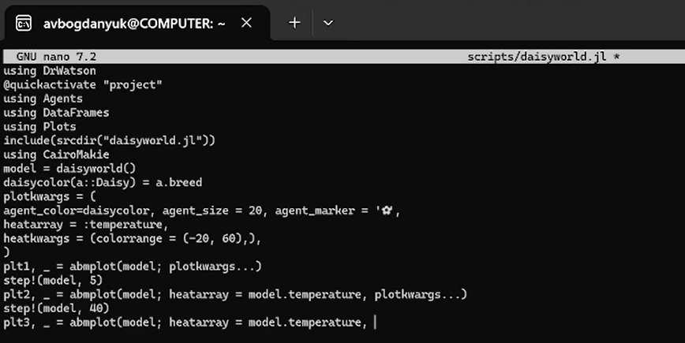
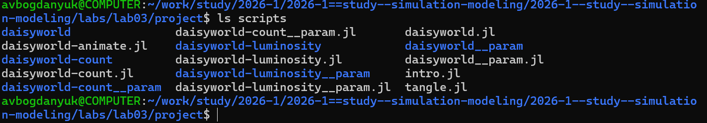
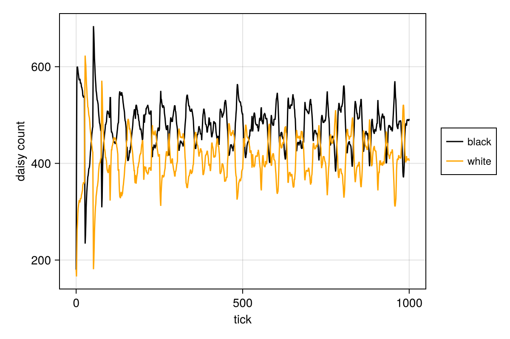
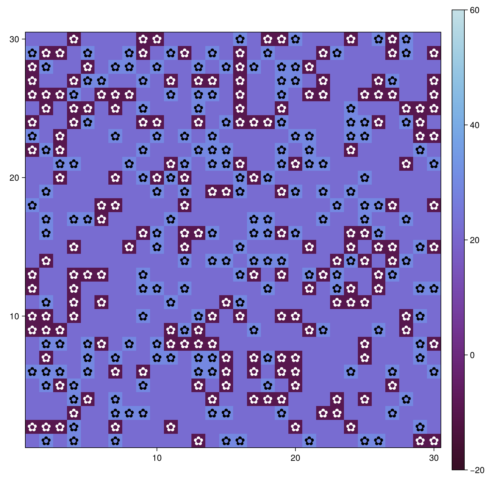

---
## Author
author:
  name: Богданюк Анна Васильевна
  degrees: НКНбд-01-23
  affiliation:
    - name: Российский университет дружбы народов
      country: Российская Федерация
## Title
title: "Лабораторная работа 3"
subtitle: "Имитационное моделирование"
date-format: "2026-03-21"
---

# Вводная часть

## Цель работы

Целью данной лабораторной работы является создание агентных моделей, где агенты - это маргаритки двух типов — чёрные (black) и белые (white) (Модель Daisyworld).

# Основная часть

## Модель Daisyworld

Если температура становится слишком высокой или слишком низкой, маргаритки не захотят размножаться. Пока температура благоприятна, маргаритки конкурируют за землю и пытаются дать начало новому растению в местах, расположенных неподалёку от них.
Когда климат слишком холодный, черным маргариткам необходимо размножаться, чтобы повысить температуру, и наоборот — когда климат слишком теплый, необходимо производить больше белых маргариток, чтобы охладить климат.

## Модель Daisyworld

Взаимодействие живых и неживых аспектов этого мира находит равновесие в широком диапазоне параметров, хотя при достаточно сильном внешнем воздействии маргаритки не смогут регулировать температуру планеты и в конечном итоге вымрут.

## Описание модели Daisyworld

В модели Daisyworld агентами являются чёрные и белые маргаритки. Они живут на клеточной сетке (среда).
Свойства агентов: вид и возраст.

## Правила

— Маргаритки изменяют локальную температуру за счёт разного альбедо.
— Температура влияет на вероятность размножения (чем ближе к оптимуму, тем
выше шанс заселить соседнюю пустую клетку).
— Агенты стареют и умирают после определённого возраста.
— Среда (температура) диффундирует между клетками.

## Параметры

— luminosity – солнечная постоянная (может изменяться со временем).
— albedo_black, albedo_white – альбедо чёрных и белых маргариток.
— surface_albedo — альбедо пустой почвы.
— max_age — максимальный возраст маргаритки.

## Выполнение работы

Создаём рабочее пространство для работы ([рис. @fig-001]).

{#fig-001 width=70%}

## Выполнение работы

Создаю файл src/daisyworld.jl. Здесь мы определим тип агента и функции шага модели ([рис. @fig-002]).

{#fig-002 width=70%}

## Выполнение работы

Сделаем базовую визуализацию. Построим тепловую карту, которая будет представлять собой температуру поверхности модели. Маргаритки будут отображаться черно-белыми в соответствии с их видом. Для этого создадим файл scripts/daisyworld.jl ([рис. @fig-003]).

{#fig-003 width=70%}

## Выполнение работы

С помощью скрипта tangle.jl создадим производные файлы от scripts/daisyworld.jl, который мы ранее преобразовали в литературном стиле ([рис. @fig-004]).

{#fig-004 width=70%}

## Выполнение работы

В ходе лабораторной я создала 7 скриптов, с помощью которых мы могли визуально изучить модель Daisyworld, наглядно посмотреть как различные параметры влияют на размножение или погибель маргариток ([рис. @fig-005]).

{#fig-005 width=70%}

## Выполнение работы

На этом графике мы можем посмотреть как меняется количество маргариток с течением времени ([рис. @fig-006]).

{#fig-006 width=70%}

## Выполнение работы

Комплексный график изменения числа маргариток, температуры, альбедо в зависимости от модельного времени ([рис. @fig-007]).

{#fig-007 width=70%}

## Выполнение работы

Тепловая карта, которая представляет собой температуру поверхности модели. Маргаритки отображаются черно-белыми в соответствии с их видом. ([рис. @fig-008]).

{#fig-008 width=70%}

## Выводы

В ходе выполнения лабораторной работы были созданы агентные модели, где агенты - это маргаритки двух типов — чёрные (black) и белые (white) (Модель Daisyworld).

## Список литературы

::: incremental

1. . Watson A. J., Lovelock J. E. Biological homeostasis of the global environment: the parable of Daisyworld // Tellus B: Chemical and Physical Meteorology. — 1983. — Jan. — Vol. 35, no. 4. — P. 284. — ISSN 0280-6509. — DOI: 10.3402/tellusb.v35i4.14616.

:::

