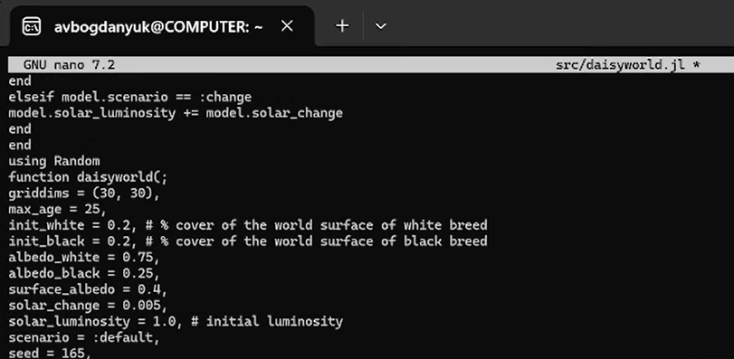
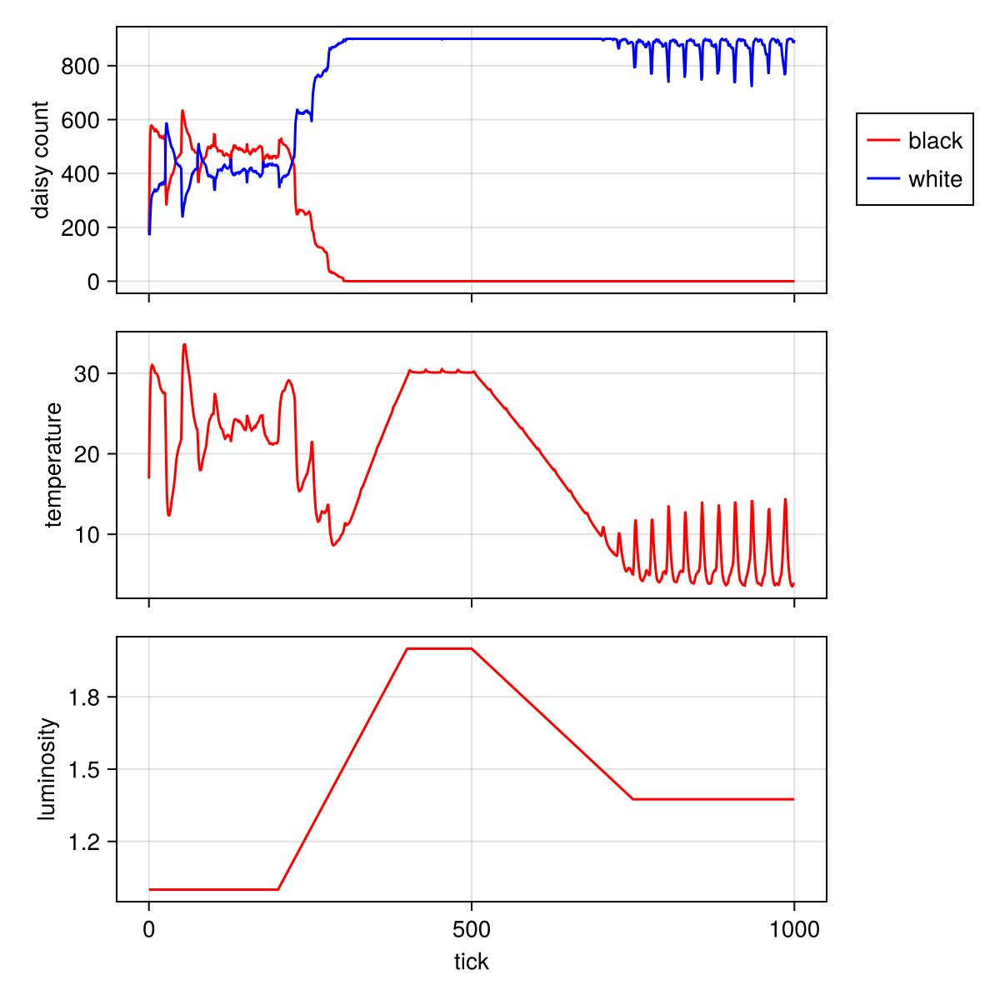

---
## Author
author:
  name: Богданюк Анна
  degrees: НКНбд-01-23
  affiliation:
    - name: Российский университет дружбы народов
      country: Российская Федерация

## Title
title: "Лабораторная работа 3"
subtitle: "Имитационное моделирование"
license: "CC BY"
---

# Цель работы

Целью данной лабораторной работы является создание агентных моделей, где агенты - это маргаритки двух типов — чёрные (black) и белые (white) (Модель Daisyworld).

# Задание

1. Создать рабочий каталог для всего курса.
2. Установить необходимые пакеты.
3. Выполнить предложенный код.
4. Преобразовать код в литературный стиль.
5. Сгенерировать из литературного кода:
6. чистый код;
7. jupyter notebook;
8. документацию в формате Quarto.
9. Выполнить код из jupyter notebook.
10. Интегрировать документацию в формате Quarto в отчёт.
11. Добавить в код в литературном стиле вычисление для набора параметров.
12. Сгенерировать из литературного кода с параметрами:
13. чистый код;
14. jupyter notebook;
15. документацию в формате Quarto.
16. Выполнить код из jupyter notebook с параметрами.
17. Интегрировать документацию с параметрами в формате Quarto в отчёт.

# Теоретическое введение

## Модель Daisyworld

Модель Daisyworld, предложенная Джеймсом Лавлоком и Эндрю Уотсоном, иллюстрирует гипотезу Геи [2; 11]. Гипотеза Геи рассматривает планету как единую,
саморегулирующуюся систему, включающую как живые, так и неживые части.
В мире маргариток произрастают чёрные и белые маргаритки. Их альбедо различается: чёрные маргаритки поглощают свет и тепло, нагревая окружающую
среду; белые маргаритки делают наоборот. Маргаритки могут размножаться только в определённом температурном диапазоне, а это значит, что слишком много
(или слишком мало) тепла от солнца и/или окружающей среды в конечном итоге
остановит их размножение.
Поверхность Геи нагревается солнцем, но растущие на ней маргаритки поглощают
или отражают свет звёзд, изменяя локальную температуру.
Если температура становится слишком высокой или слишком низкой, маргаритки
не захотят размножаться. Пока температура благоприятна, маргаритки конкурируют за землю и пытаются дать начало новому растению в местах, расположенных
неподалёку от них.
Когда климат слишком холодный, черным маргариткам необходимо размножаться, чтобы повысить температуру, и наоборот — когда климат слишком теплый,
необходимо производить больше белых маргариток, чтобы охладить климат.
Взаимодействие живых и неживых аспектов этого мира находит равновесие в
широком диапазоне параметров, хотя при достаточно сильном внешнем воздействии маргаритки не смогут регулировать температуру планеты и в конечном
итоге вымрут.

## Описание модели Daisyworld

В модели Daisyworld агентами являются чёрные и белые маргаритки. Они живут
на клеточной сетке (среда).
Свойства агентов: вид и возраст.
Правила:
— Маргаритки изменяют локальную температуру за счёт разного альбедо.
— Температура влияет на вероятность размножения (чем ближе к оптимуму, тем
выше шанс заселить соседнюю пустую клетку).
— Агенты стареют и умирают после определённого возраста.
— Среда (температура) диффундирует между клетками.

### Агенты

Маргаритки двух типов — чёрные (black) и белые (white). Каждая маргаритка
занимает одну клетку сетки и имеет возраст (количество шагов с момента появления).

### Пространство

Двумерная квадратная сетка (например, 30×30) с периодическими границами.

### Параметры

— luminosity – солнечная постоянная (может изменяться со временем).
— albedo_black, albedo_white – альбедо чёрных и белых маргариток.
— surface_albedo — альбедо пустой почвы.
— max_age — максимальный возраст маргаритки.

### Динамика

— Для каждой клетки рассчитывается локальная температура.
— Каждая маргаритка может погибнуть с вероятностью, зависящей от температуры. Если температура выходит за допустимый диапазон, вероятность смерти
повышается.
— Если клетка пуста, на неё может попасть семя от соседней маргаритки. Вероятность успешного прорастания зависит от температуры клетки. Если вероятность превышает случайное число, на пустой клетке появляется новая
маргаритка того же цвета, что и родительская.

# Выполнение лабораторной работы

Создаём рабочее пространство для работы ([рис. @fig-001]).

{#fig-001 width=70%}

Создаю файл src/daisyworld.jl. Здесь мы определим тип агента и функции шага модели ([рис. @fig-002]).

{#fig-002 width=70%}

Сделаем базовую визуализацию. Построим тепловую карту, которая будет представлять собой температуру поверхности модели. Маргаритки будут отображаться черно-белыми в соответствии с их видом. Для этого создадим файл scripts/daisyworld.jl ([рис. @fig-003]).

{#fig-003 width=70%}

С помощью скрипта tangle.jl создадим производные файлы от scripts/daisyworld.jl, который мы ранее преобразовали в литературном стиле ([рис. @fig-004]).

{#fig-004 width=70%}

В ходе лабораторной я создала 7 скриптов, с помощью которых мы могли визуально изучить модель Daisyworld, наглядно посмотреть как различные параметры влияют на размножение или погибель маргариток ([рис. @fig-005]).

{#fig-005 width=70%}

На этом графике мы можем посмотреть как меняется количество маргариток с течением времени ([рис. @fig-006]).

{#fig-006 width=70%}

Комплексный график изменения числа маргариток, температуры, альбедо в зависимости от модельного времени ([рис. @fig-007]).

{#fig-007 width=70%}

Тепловая карта, которая представляет собой температуру поверхности модели. Маргаритки отображаются черно-белыми в соответствии с их видом. ([рис. @fig-008]).

{#fig-008 width=70%}

# Выводы

В ходе выполнения лабораторной работы были созданы агентные модели, где агенты - это маргаритки двух типов — чёрные (black) и белые (white) (Модель Daisyworld).

# Список литературы

1. . Watson A. J., Lovelock J. E. Biological homeostasis of the global environment: the parable of Daisyworld // Tellus B: Chemical and Physical Meteorology. — 1983. — Jan. — Vol. 35, no. 4. — P. 284. — ISSN 0280-6509. — DOI: 10.3402/tellusb.v35i4.14616.
