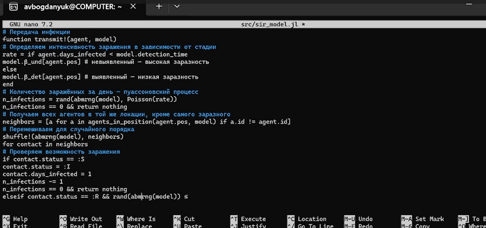
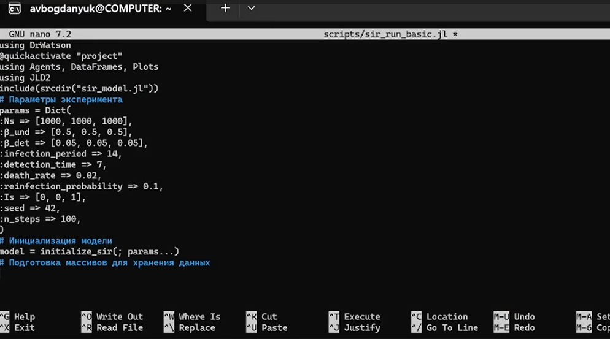
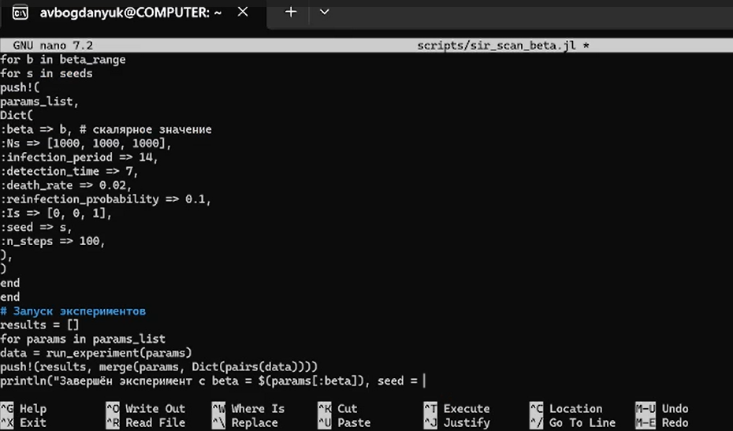
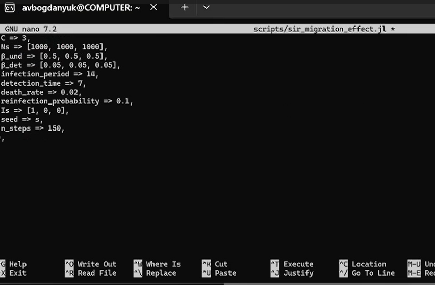
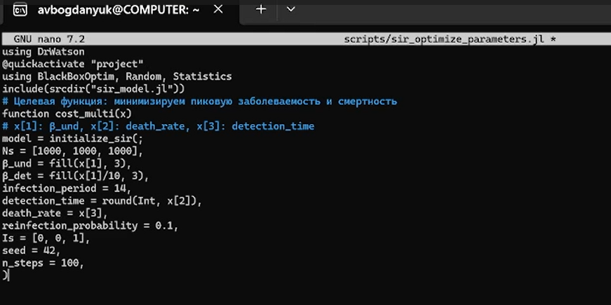
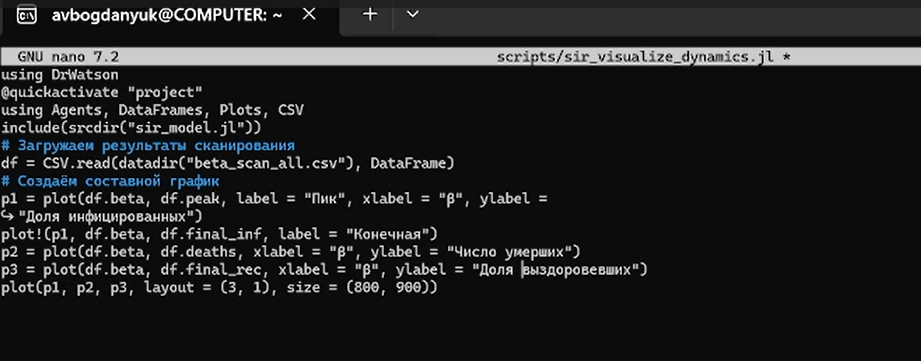
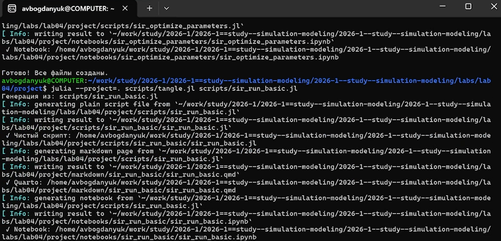

---
## Author
author:
  name: Богданюк Анна
  degrees: НКНбд-01-23
  affiliation:
    - name: Российский университет дружбы народов
      country: Российская Федерация

## Title
title: "Лабораторная работа 4"
subtitle: "Имитационное моделирование"
license: "CC BY"
---

# Цель работы

Целью данной лабораторной работы является создание агентной модели распростроненния инфекционного заболевания на основе классической компартментальной модели SIR (Susceptible-Infectious-Recovered).

# Задание

1. Создать рабочий каталог для всего курса.
2. Установить необходимые пакеты.
3. Выполнить предложенный код.
4. Преобразовать код в литературный стиль.
5. Сгенерировать из литературного кода:
6. чистый код;
7. jupyter notebook;
8. документацию в формате Quarto.
9. Выполнить код из jupyter notebook.
10. Интегрировать документацию в формате Quarto в отчёт.
11. Добавить в код в литературном стиле вычисление для набора параметров.
12. Сгенерировать из литературного кода с параметрами:
13. чистый код;
14. jupyter notebook;
15. документацию в формате Quarto.
16. Выполнить код из jupyter notebook с параметрами.
17. Интегрировать документацию с параметрами в формате Quarto в отчёт.

# Теоретическое введение

## Классическая модель SIR

Модель SIR, предложенная Кермаком и Маккендриком в 1927 году, описывает
динамику эпидемии в популяции, разделённой на три группы:
— 𝑆 (Susceptible) — восприимчивые к заболеванию индивиды;
— 𝐼 (Infectious) — инфицированные, способные заражать восприимчивых;
— 𝑅 (Recovered) — выздоровевшие (или умершие), получившие иммунитет и более
не участвующие в распространении.

##  Ограничения классического подхода

Несмотря на широкое применение, модель на ОДУ имеет ряд ограничений:
— Однородность популяции — все индивиды считаются одинаковыми.
— Отсутствие пространственной структуры — предполагается полное перемешивание.
— Детерминированность — не учитываются случайные флуктуации.
— Непрерывность — количество людей рассматривается как непрерывная величина.

##  Преимущества агентного подхода

Агентное моделирование позволяет преодолеть эти ограничения:
— Каждый индивид моделируется отдельно с уникальными характеристиками.
— Взаимодействия происходят локально в пространстве или социальной сети.
— Процессы носят стохастический характер.
— Можно учитывать гетерогенность контактов, мобильность, меры контроля.

## Агенты

Каждый агент — человек, обладающий следующими свойствами:
— status::Symbol — состояние (:S, :I, :R);
— days_infected::Int — количество дней с момента заражения (для инфицированных)

## Параметры модели

— Ns — вектор численности населения по локациям;
— β_und — вероятность передачи для невыявленных случаев;
— β_det — вероятность передачи для выявленных случаев;
— infection_period — длительность заболевания (дней);
— detection_time — время до выявления заболевания;
— death_rate — вероятность летального исхода;
— reinfection_probability — вероятность повторного заражения;
— migration_rates — матрица вероятностей миграции между локациями.

## Динамика

На каждом шаге (соответствует одному дню) для каждого агента выполняются
следующие процессы :
— Миграция — агент может переместиться в другую локацию с вероятностью,
заданной матрицей migration_rates.
— Передача инфекции — если агент инфицирован, он может заразить восприимчивых агентов в той же локации. Количество заражённых за день определяется
пуассоновским процессом с интенсивностью, зависящей от статуса выявления
(β_und или β_det).
— Обновление счётчика — для инфицированных увеличивается days_infected.
— Выздоровление или смерть — если days_infected достиг infection_period,
агент либо выздоравливает (переходит в R), либо умирает (удаляется из модели)
с вероятностью death_rate. Выздоровевшие могут быть повторно инфицированы с вероятностью reinfection_probability.

# Выполнение лабораторной работы

Создаём рабочее пространство для работы. Создаём код модели, который будем далее использоватьв других скриптах ([рис. @fig-001]).

{#fig-001 width=70%}

Далее программу для запуска базового эксперемента с фиксированными параметрами (по умолчанию) и сохраняем динамику численности агентов. Это служит для проверки работоспособности модели и получения базового понимания эпидемического процесса. ([рис. @fig-002]).

{#fig-002 width=70%}

Создаём скрипт, который исследует, как изменение базовой заразности (β_und и пропорционально β_det) влияет на эпидемические показатели: пик заболеваемости, долю переболевших, число умерших. Выполняется параметрическое сканирование с несколькими повторными прогонами для учёта стохастичности ([рис. @fig-003]).

{#fig-003 width=70%}

Создаём скрипт, который исследует, как интенсивность перемещения людей между городами влияет на
скорость распространения эпидемии (время достижения пика) и масштаб пика.
Инфекция начинается только в одном городе, остальные изначально здоровы ([рис. @fig-004]).

{#fig-004 width=70%}

Создаём скрипт, который ищет оптимальные комбинации параметров, минимизирующие одновременно
два критерия: пиковую заболеваемость и долю умерших. Использует эволюционный алгоритм (Borg MOEA) из пакета BlackBoxOptim ([рис. @fig-005]).

{#fig-005 width=70%}

Создаём скрипт, который загружает результаты параметрического сканирования (файл data/beta_scan_all.csv, созданный scan_beta.jl) и строит единый составной график, объединяющий три панели:пик эпидемии и конечная доля инфицированных, число умерших, доля выздоровевших ([рис. @fig-006]).

{#fig-006 width=70%}

Затем я преобразовала все скрипты, созданные в ходе выполнения лабораторной работы, в литературном стиле. И с помощью скрипта tangle.jl создала произвольные форматы для каждого ([рис. @fig-007]).

{#fig-007 width=70%}

Результат работы программы sir_run_basic.jl ([рис. @fig-008]).

{#fig-008 width=70%}

Результат работы программы sir_beta_scan.jl ([рис. @fig-009]).

{#fig-009 width=70%}

Результат работы программы sir_migration_effect.jl ([рис. @fig-010]).

{#fig-010 width=70%}

Результат работы программы sir_visualize_dynamics.jl ([рис. @fig-011]).

{#fig-011 width=70%}

# Выводы

В ходе выполнения лабораторной работы была создана агентная модель распростроненния инфекционного заболевания на основе классической компартментальной модели SIR (Susceptible-Infectious-Recovered).

# Список литературы

1. Hethcote H. W. The Mathematics of Infectious Diseases // SIAM Review. — 2000. — Jan. — Vol. 42, no. 4. — P. 599–653. — ISSN 1095-7200. — DOI: 10.1137/s0036144 500371907.
2. Kermack W. O., McKendrick A. G. A Contribution to the Mathematical Theory of Epidemics // Proceedings of the Royal Society of London. Series A Containing Papers of a Mathematical and Physical Character. — 1927. — Авг. — Т. 115, № 772. — С. 700—721. — ISSN 2053-9150. — DOI: 10.1098/rspa.1927.0118.
