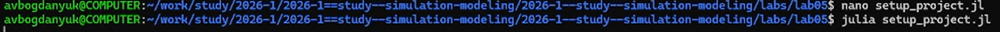
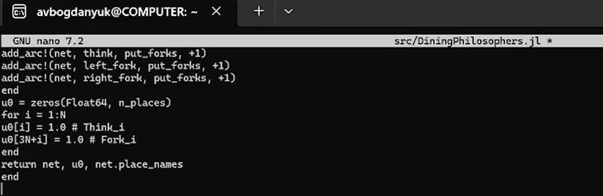
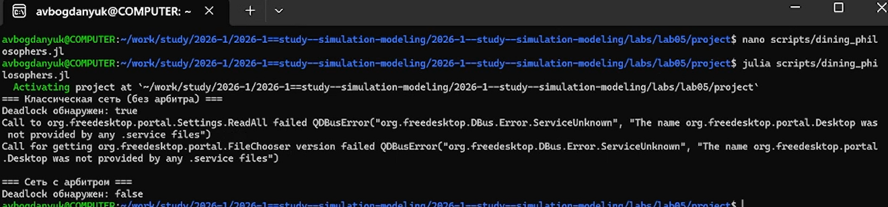
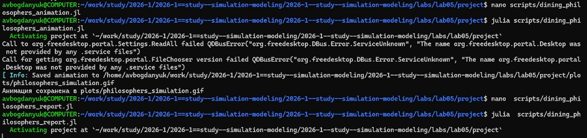
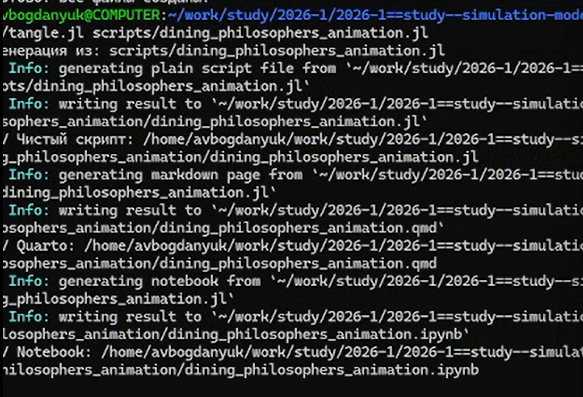
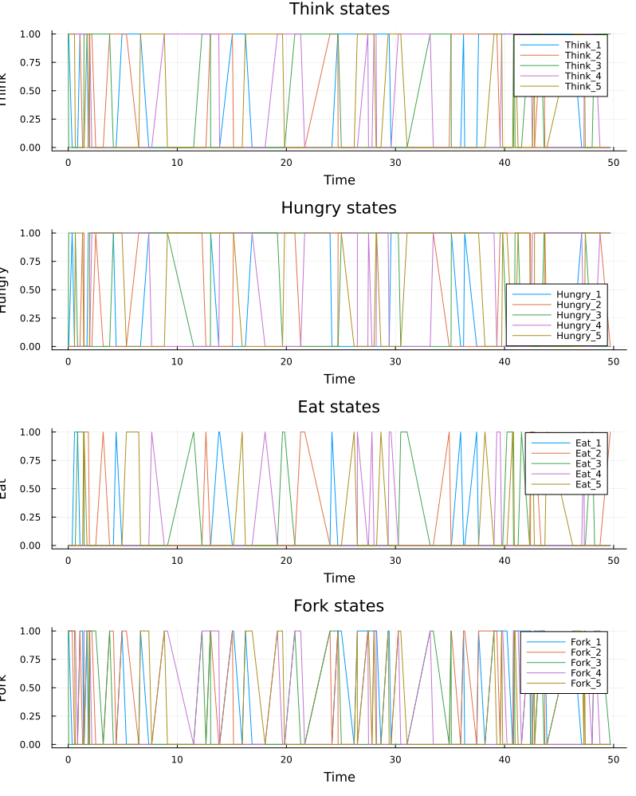
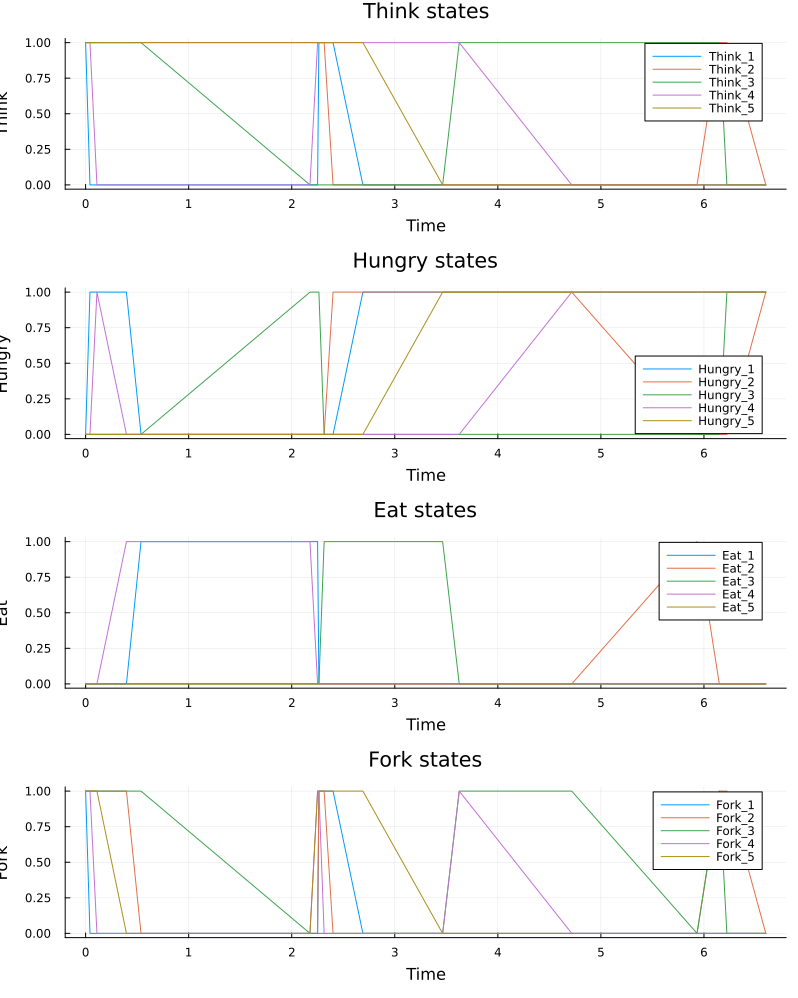
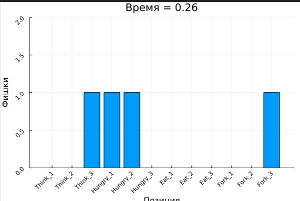
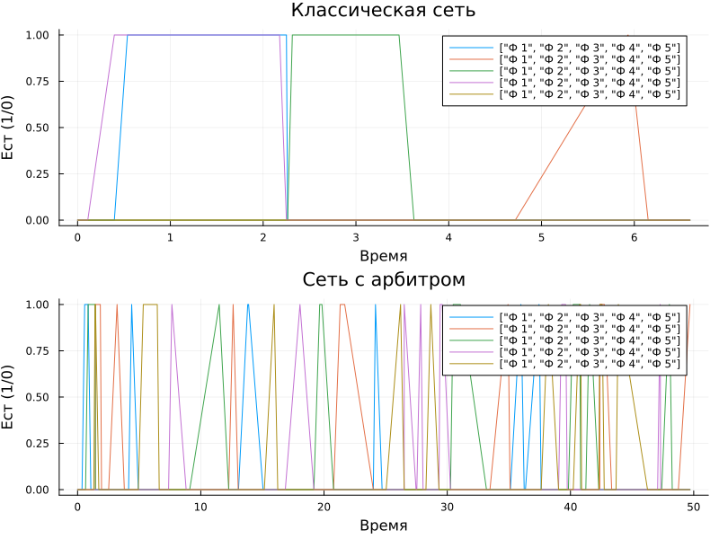

---
## Author
author:
  name: Богданюк Анна Васильевна
  degrees: НКНбд-01-23
  affiliation:
    - name: Российский университет дружбы народов
      country: Российская Федерация
## Title
title: "Лабораторная работа 5"
subtitle: "Имитационное моделирование"
date-format: "2026-04-18"
---

# Вводная часть

## Цель работы

- Построить сеть Петри для пяти философов, моделируя захват и освобождение вилок.
- Обнаружить состояние взаимной блокировки (deadlock), когда каждый философ взял одну вилку и ждёт вторую.
- Провести имитационное моделирование (стохастическое и детерминированное) и выявить наличие deadlock.
- Модифицировать сеть, чтобы предотвратить deadlock.
- Проанализировать результаты и оформить отчёт с графиками и анимацией.

# Основная часть

## Базовые элементы и принцип работы

В основе сети Петри лежит двудольный ориентированный мультиграф — это означает, что вершины в ней делятся на два типа, дуги всегда соединяют вершины
разных типов, и между двумя вершинами может быть несколько дуг.

**Позиции (Places) — «Условия»**

Пассивные элементы, которые обозначаются кружками. Они описывают состояния системы, наличие ресурса или выполнение некоторого условия.

Метки (Tokens): Внутри позиции могут находиться фишки (маркеры), обозначаемые точками или числом. Они символизируют количество ресурсов или кратность
выполнения условия. Состояние сети определяется распределением фишек по
всем позициям и называется маркировкой.

## 

**Переходы (Transitions) — «События»**

Активные элементы, обозначаемые прямоугольниками. Они моделируют действия, события или процессы, которые могут произойти в системе.

**Дуги (Arcs) — «Связи»**

Направленные связи между позициями и переходами.
- Входные дуги (от позиции к переходу) указывают, какие условия и сколько фишек необходимо для срабатывания события.
- Выходные дуги (от перехода к позиции) показывают, какие условия станут истинными после события и сколько фишек там появится.

Срабатывание перехода есть атомарная операция, которая происходит мгновенно
и меняет маркировку сети. Если разрешено несколько переходов, любой из них
может сработать.

## Формальное определение

Сеть Петри (N-схема) — это четвёрка:
𝑁 = (𝑃, 𝑇, 𝐹, 𝑀0),

где:
- 𝑃 = 𝑝1, 𝑝2, ..., 𝑝𝑛 — конечное множество позиций (мест);
- 𝑇 = 𝑡1, 𝑡2, ..., 𝑡𝑚 — конечное множество переходов;
- 𝐹 ⊆ (𝑃 × 𝑇 ) ∪ (𝑇 × 𝑃) — множество дуг (отношения инцидентности);
- 𝑀0 ∶ 𝑃 → ℕ — маркировка, задающая начальное распределение фишек

## Обедающие философы. Классическая постановка

За круглым столом сидят N философов (обычно 5). Перед каждым философом стоит тарелка с едой. Между каждыми двумя соседними философами лежит одна вилка (или палочка для еды). Таким образом, количество вилок равно количеству философов.
Правила поведения философов:
- Философ может находиться в одном из трёх состояний: думает, голоден (хочет есть), ест.
- Чтобы поесть, философу необходимы две вилки — та, что слева от него, и та, что справа.
- Если философ не может получить обе вилки одновременно, он ждёт, пока они освободятся.
- Поев, философ кладёт обе вилки обратно на стол и возвращается к размышлениям.

##

**Ограничения:**
- Вилками нельзя пользоваться одновременно двум философам.
- Философ не может отнять вилку у соседа — только дождаться, пока тот её положит

## Проблема взаимной блокировки (deadlock)

При наивной реализации (каждый философ сначала берёт левую вилку, затем
правую) возникает тупиковая ситуация: если все философы одновременно возьмут левую вилку, то каждый будет ждать правую, которая уже занята соседом.
В результате никто не может поесть — система замирает. Это и есть взаимная
блокировка.

## Решения проблемы

**Арбитр (официант)** — вводится дополнительный процесс, который разрешает
есть не более чем N-1 философам одновременно.

## Выполнение работы

Создаём рабочее пространство для работы ([рис. @fig-001]).

{#fig-001 width=70%}

## Выполнение работы

Создаём код модели ([рис. @fig-002]).

{#fig-002 width=70%}

## Выполнение работы

Создаём файл scripts/dining_philosophers.jl ([рис. @fig-003]).

{#fig-003 width=70%}

## Выполнение работы

**Зачем?**

Скрипт выполняет основное моделирование и сравнение двух вариантов сети Петри:
- классическая модель (без арбитра), в которой возможна взаимная блокировка (deadlock);
- модифицированная модель с арбитром, которая должна предотвращать deadlock

## Выполнение работы

**Что делает?**

- Создаёт классическую сеть Петри для N=5 философов с помощью build_classical_network.
- Запускает стохастическую симуляцию (алгоритм Гиллеспи) на время tmax = 50.0.
- Сохраняет полную историю маркировок в CSV-файл (dining_classic.csv).
- Анализирует последнее состояние на предмет deadlock с помощью detect_deadlock и выводит результат в консоль.
- Строит графики эволюции маркировки по всем позициям (Think, Hungry, Eat, Fork) и сохраняет их как classic_simulation.png.
- Повторяет шаги 1–5 для сети с арбитром (build_arbiter_network), сохраняя результаты в dining_arbiter.csv и arbiter_simulation.png.

Создаём файлы scripts/dining_philosophers_animation.jl и scripts/dining_philosophers_report.jl. Один для создания анимации эксперемента, а второй - для создания отчёта по результатам базовой эксперемента ([рис. @fig-004]).

## Выполнение работы

{#fig-004 width=70%}

Создаём файлы scripts/tangel.jl для того, чтобы преобразовать скрипты в производные форматы и преобразоваываем ([рис. @fig-005]).

## Выполнение работы

{#fig-005 width=70%}

Результат программы scripts/dining_philosophers.jl ([рис. @fig-006]).

## Выполнение работы

{#fig-006 width=70%}

Результат программы scripts/dining_philosophers.jl ([рис. @fig-007]).

## Выполнение работы

{#fig-007 width=70%}

Результат программы scripts/dining_philosophers_animation.jl ([рис. @fig-008]).

## Выполнение работы

{#fig-008 width=70%}

## Выполнение работы

Результат программы scripts/dining_philosophers_report.jl ([рис. @fig-009]).

{#fig-009 width=70%}

## Выводы

В ходе выполнения лабораторной работы была построена сеть Петри для пяти философов, моделируя захват и освобождение вилок, обнаружена состояние взаимной блокировки (deadlock), когда каждый философ взял одну вилку и ждёт вторую, было проведено имитационное моделирование (стохастическое и детерминированное) и выявлено наличие deadlock, была модифицировать сеть, чтобы предотвратить deadlock, были проанализированы результаты и был оформлен отчёт с графиками и анимацией.

## Список литературы

::: incremental

1. Knuth D. E. Literate Programming // The Computer Journal. — 1984. — Feb. — Vol. 27, no. 2. — P. 97–111. — ISSN  1460-2067. — DOI: 10.1093/comjnl/27.2.97.
2. A Multi-Language Computing Environment for Literate Programming and Reproducible Research / E. Schulte [et al.] // Journal of Statistical Software. — 2012. — Vol. 46, no. 3. — ISSN 1548-7660. — DOI: 10.18637/jss.v046.i03.
3. The Story in the Notebook / M. B. Kery [et al.] // Proceedings of the 2018 CHI Conference on Human Factors in Computing Systems. — ACM, 04/2018. — P. 1– 11. — DOI: 10.1145/3173574.3173748.

:::

