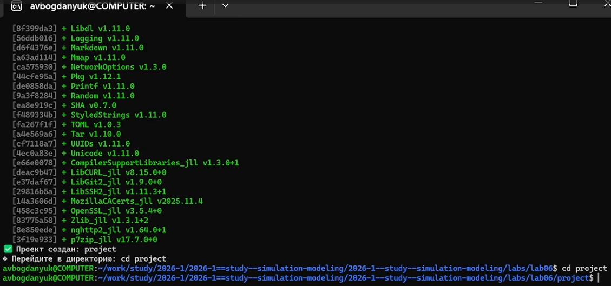
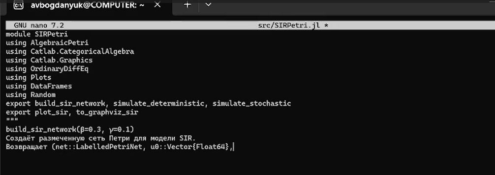
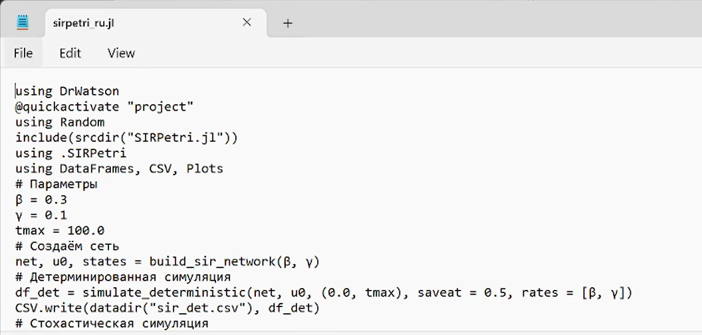
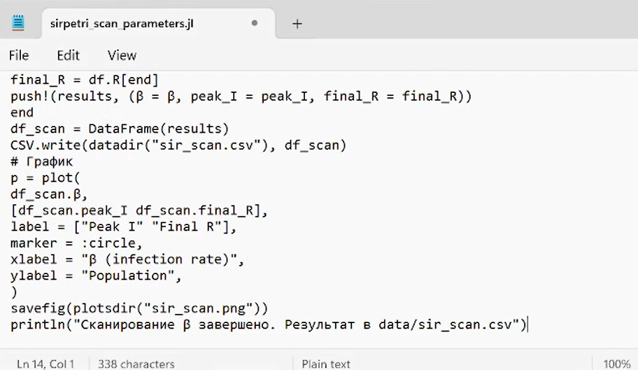
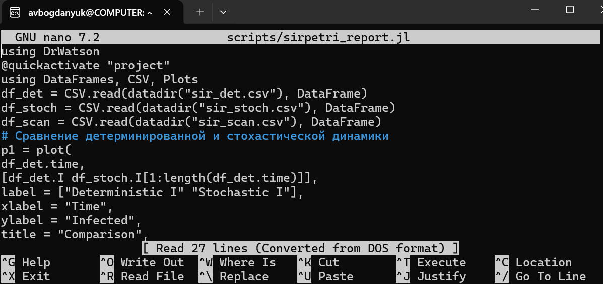
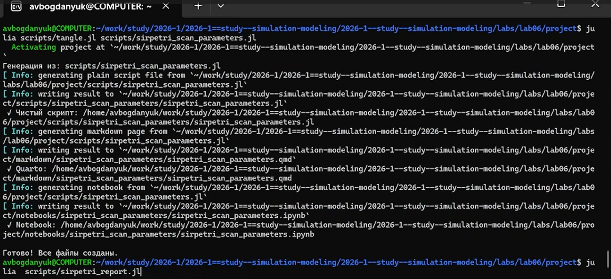

---
## Author
author:
  name: Богданюк Анна Васильевна
  degrees: НКНбд-01-23
  affiliation:
    - name: Российский университет дружбы народов
      country: Российская Федерация
## Title
title: "Лабораторная работа 6"
subtitle: "Имитационное моделирование"
date-format: "2026-05-01"
---

# Вводная часть

## Цель работы

Создать код модели SIR в подходе сетей Петри, провести базовый эксперемент, просканировать зависимость хода эпидемии от параметра скорости β, визуализировать результаты и создать итоговый отчёт.

# Основная часть

## Описание модели

Реализована модель эпидемии SIR (Susceptible–Infectious–Recovered) с использованием сетей Петри. Модель описывает переходы между тремя состояниями:
1. S (восприимчивые) — могут заразиться;
2. I (инфицированные) — заражают других и выздоравливают;
3. R (выздоровевшие / с иммунитетом) — больше не участвуют в эпидемии.

Сеть Петри содержит два перехода:
1. infection: S + I → I + I (скорость β);
2. recovery: I → R (скорость γ).

## Основная программа

**Построение сети Петри**
- Функция: build_sir_network(β, γ)
- Создаёт размеченную сеть Петри (LabelledPetriNet) с двумя переходами:
- infection: S + I → I + I (скорость β)
- recovery: I → R (скорость γ)
- Возвращает:
- объект сети net,
- начальную маркировку u0 = [990.0, 10.0, 0.0],
- имена состояний [:S, :I, :R].

## Основная программа

**Детерминированная симуляция**
- Функция: simulate_deterministic(net, u0, tspan; saveat, rates)
- Строит систему обыкновенных дифференциальных уравнений (ОДУ) на основе закона действующих масс.
- Решает её численно с помощью OrdinaryDiffEq (метод Tsit5).
- Возвращает DataFrame с колонками time, S, I, R.

**Стохастическая симуляция**
- Файл: simulate_stochastic(net, u0, tspan; rates, rng) 
- Используется алгоритм Гиллеспи. 
- Реализует прямой метод Гиллеспи (SSA) для дискретных событий. 
- На каждом шаге вычисляет пропускные способности:
- a_inf = β * S * I
- a_rec = γ * I
- Случайным образом выбирает, произойдёт ли заражение или выздоровление, и через какое время.
- Возвращает DataFrame с временами и целочисленными маркировками.

## Основная программа

**Вспомогательная функция ОДУ**
- Функция: sir_ode(net, rates)
- Возвращает функцию правой части f!(du, u, p, t), которая используется в simulate_deterministic.
- Сделана отдельно для гибкости.

**Визуализация**
- Функция: plot_sir(df)
- Принимает DataFrame с колонками time, S, I, R и строит стандартный график динамики.

**Визуализация сети Петри**
- Функция: to_graphviz_sir(net) - Использует Catlab.Graphics.to_graphviz
для создания графа сети.

## Выполнение работы

Создаём рабочее пространство для работы ([рис. @fig-001]).

{#fig-001 width=70%}

## Выполнение работы

Создаём код основной модели ([рис. @fig-002]).

{#fig-002 width=70%}

## Выполнение работы

Создаём код для базового прогона ([рис. @fig-003]).

{#fig-003 width=70%}

## Выполнение работы

График детерминированной симуляции (решение ОДУ), даёт плавную усреднённую динамику ([рис. @fig-004]).

{#fig-004 width=70%}

## Выполнение работы

График стохастической симуляции (алгоритм Гиллеспи), учитывает случайные флуктуации ([рис. @fig-005]).

{#fig-005 width=70%}

## Выполнение работы

Исследуется чувствительность модели к изменению параметра β (скорости заражения) ([рис. @fig-006]).

{#fig-006 width=70%}

## Выполнение работы

Для каждого прогона вычисляются: максимальное число инфицированных (пик эпидемии) – peak_I и конечное число выздоровевших – final_R ([рис. @fig-007]).

{#fig-007 width=70%}

## Выполнение работы

Строит сравнительные графики для итогового отчёта: один - сравнение детерминированной и стохастической динамики инфицированных I(t), другой - зависимость пика I от β (результат сканирования). ([рис. @fig-008]).

{#fig-008 width=70%}

## Выполнение работы

Сравнение детерминированной и стохастической кривых I(t) показывает, насколько велик разброс, вызванный случайностью. При большом размере популяции они близки ([рис. @fig-009]).

{#fig-009 width=70%}

## Выполнение работы

График чувствительности позволяет количественно оценить, как изменение заразности β влияет на тяжесть эпидемии (пик I). Это важно для принятия решений (например, меры по снижению β) ([рис. @fig-010]).

{#fig-010 width=70%}

## Выполнение работы

Создаю производные форматы ([рис. @fig-011]).

{#fig-011 width=70%}

## Выводы

В ходе выполнения лабораторной работы был создан код модели SIR в подходе сетей Петри, проведён базовый эксперемент, просканирована зависимость хода эпидемии от параметра скорости β, визуализированы результаты и создан итоговый отчёт.

## Список литературы

::: incremental

1. Hethcote H. W. The Mathematics of Infectious Diseases // SIAM Review. — 2000. — Jan. — Vol. 42, no. 4. — P. 599–653. — ISSN 1095-7200. — DOI: 10.1137/s0036144500371907.
2. Kermack W. O., McKendrick A. G. A Contribution to the Mathematical Theory of Epidemics // Proceedings of the Royal Society of London. Series A Containing Papers of a Mathematical and Physical Character. — 1927. — Авг. — Т. 115, № 772. — С. 700—721. — ISSN 2053-9150. — DOI: 10.1098/rspa.1927.0118.

:::

