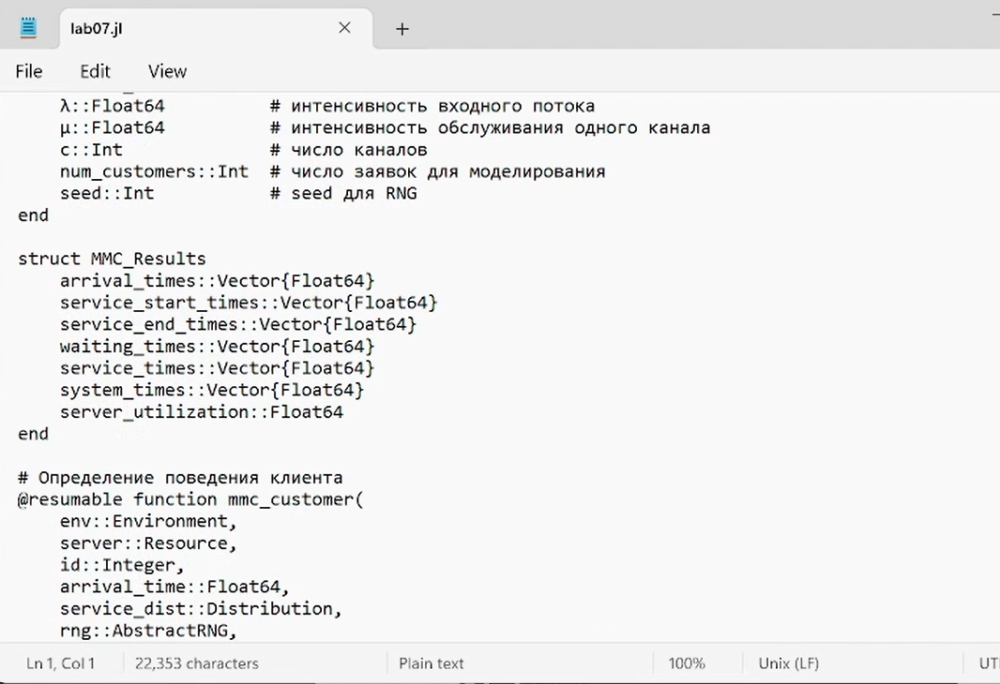
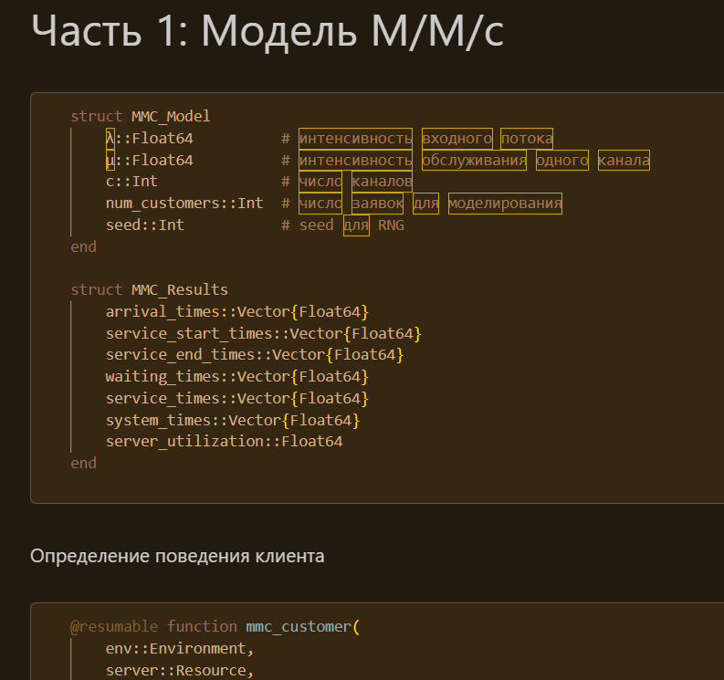
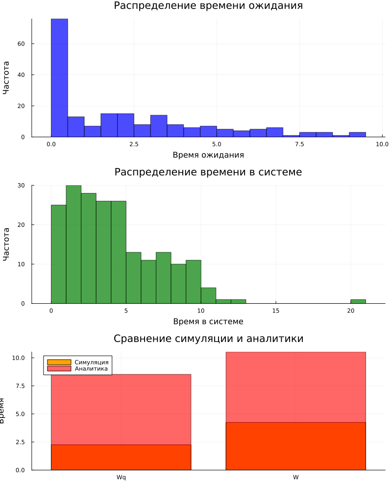
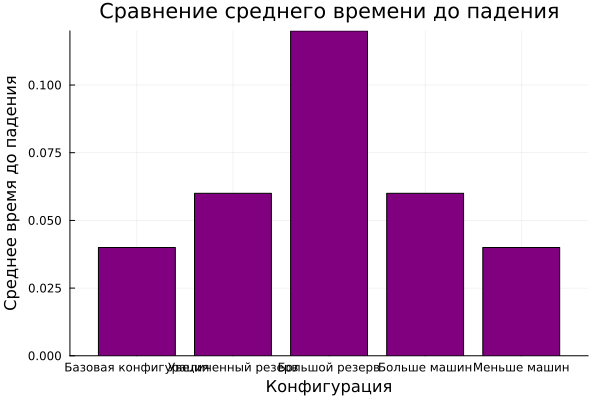
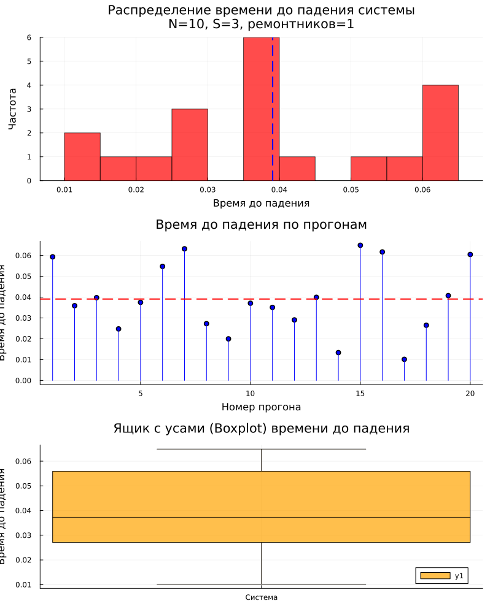
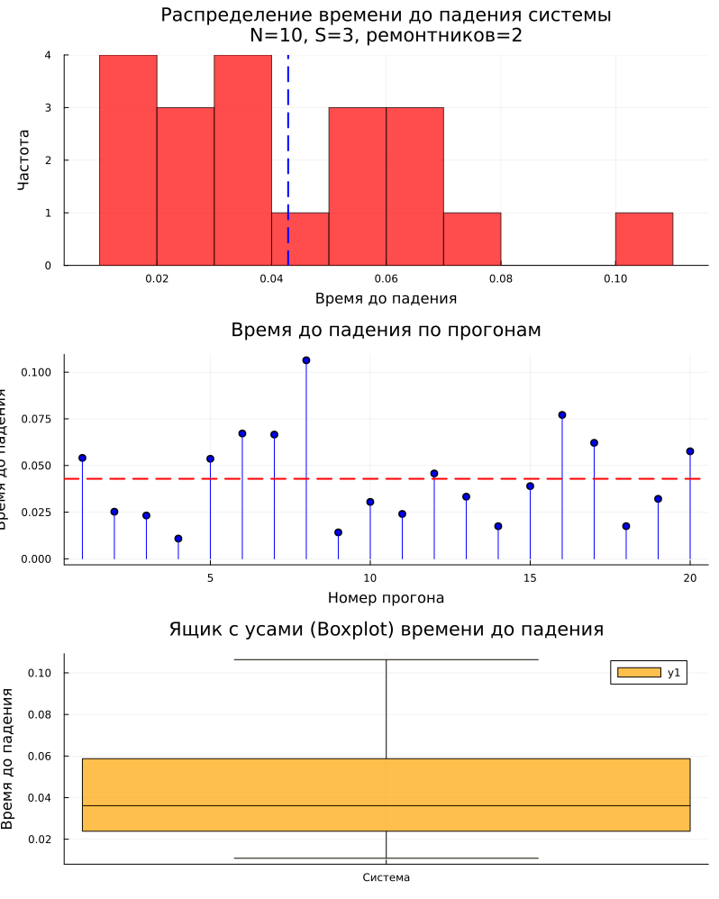
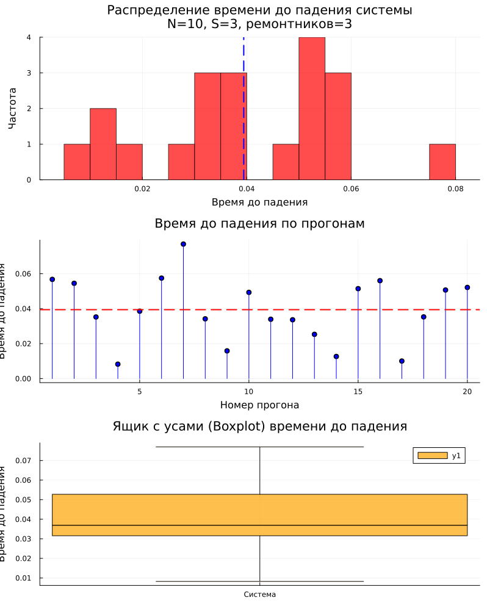
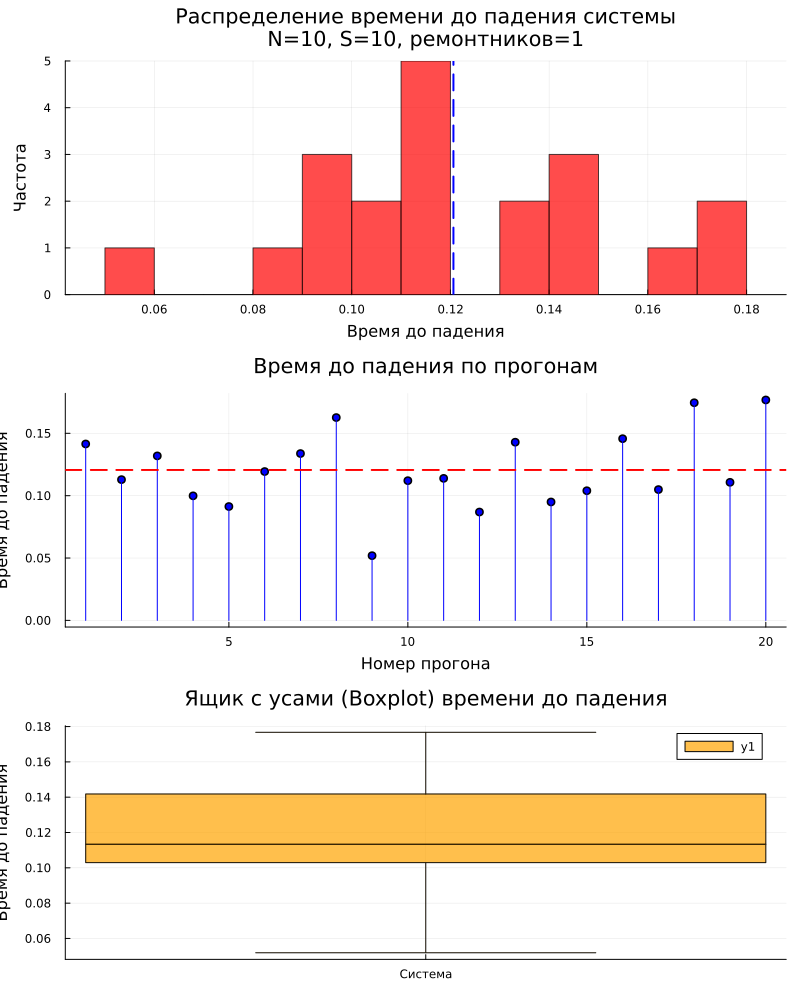
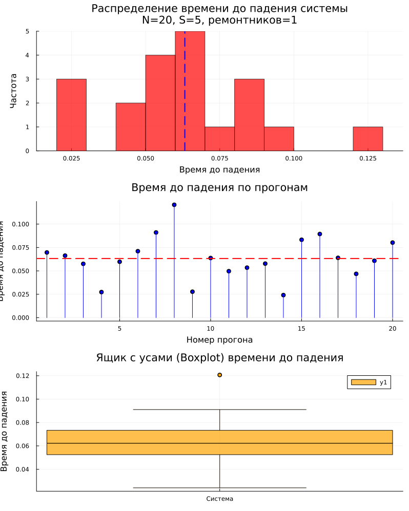

---
## Author
author:
  name: Богданюк Анна Васильевна
  degrees: НКНбд-01-23
  affiliation:
    - name: Российский университет дружбы народов
      country: Российская Федерация
## Title
title: "Лабораторная работа 7"
subtitle: "Имитационное моделирование"
date-format: "2026-05-16"
---

# Вводная часть

## Цель работы

- Перевести в структуру DrWatson.
- Добавить нескольких ремонтников.
- Сделать прогон для разного количества машин.
- Провести мониторинг загрузки ремонтника, средней длины очереди на ремонт.
- Построить графиков изменения числа исправных машин во времени.
- Сравнить с аналитическим решением.

# Основная часть

## Модель M/M/c

Модель M/M/c (по классификации Кендалла) — это система массового обслуживания со следующими свойствами:

- M (Markovian) — входящий поток заявок пуассоновский, интервалы между прибытиями распределены экспоненциально с параметром λ.
- M — время обслуживания каждой заявки распределено экспоненциально с параметром μ.
- c — количество идентичных обслуживающих приборов (каналов), работающих параллельно.

##  Модель Росса

Модель представляет собой классический пример системы массового обслуживания с конечной популяцией, резервом и ремонтом.

## Формальная постановка задачи

- В системе находятся N идентичных машин, которые постоянно работают и могут выходить из строя.
- S машин находятся в резерве и готовы немедленно заменить любую отказавшую.
- Одно ремонтное устройство (ремонтник), которое может одновременно ремонтировать только одну машину.
- Когда работающая машина ломается, происходит следующее:
- Немедленно берётся одна резервная машина (если она есть) и запускается в работу вместо сломавшейся.
- Сломанная машина отправляется в ремонт.
- Если резерва нет, система падает (crash). Моделирование заканчивается.
- После ремонта машина пополняет пул резервных (становится исправной и ждёт).
- Требуется оценить среднее время до падения системы E[T] при заданных распределениях наработки до отказа и времени ремонта

## Выполнение работы

Создаём рабочее пространство для работы. Потом создаю скрипт для реализации двух моделей ([рис. @fig-001]).

{#fig-001 width=70%}

## Выполнение работы

Создаю производные форматы от скрипта lab07.jl ([рис. @fig-002]).

{#fig-002 width=70%}

## Выполнение работы

Графики модели M/M/c ([рис. @fig-003]).

{#fig-003 width=70%}

## Выполнение работы

Графики сравнения среднего времени до падения системы модели Росса ([рис. @fig-004]).

{#fig-004 width=70%}

## Выполнение работы

Графики модели Росса при N=10, S=3  ([рис. @fig-005]).

{#fig-005 width=70%}

## Выполнение работы

Графики модели Росса при N=10, S=3  ([рис. @fig-006]).

{#fig-006 width=70%}

## Выполнение работы

Графики модели Росса при N=10, S=3  ([рис. @fig-007]).

{#fig-007 width=70%}

## Выполнение работы

Графики модели Росса при N=5, S=3  ([рис. @fig-008]).

{#fig-008 width=70%}

## Выполнение работы

Графики модели Росса при N=10, S=10  ([рис. @fig-009]).

{#fig-009 width=70%}

## Выполнение работы

Графики модели Росса при N=20, S=5  ([рис. @fig-010]).

{#fig-010 width=70%}

## Выводы

В ходе выполнения лабораторной работы была переведена основная модель в структуру DrWatson, добавлено нескольких ремонтников, сделан прогон для разного количества машин, проведен мониторинг загрузки ремонтника, средней длины очереди на ремонт, построен графиков изменения числа исправных машин во времени, сравнины с аналитическим решением.

## Список литературы

::: incremental

1. [Лабораторная №7](https://esystem.rudn.ru/pluginfile.php/3153263/mod_resource/content/1/lab07.pdf)

:::

